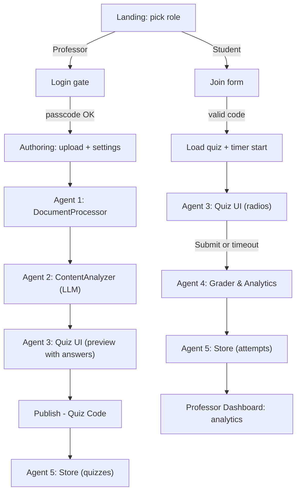
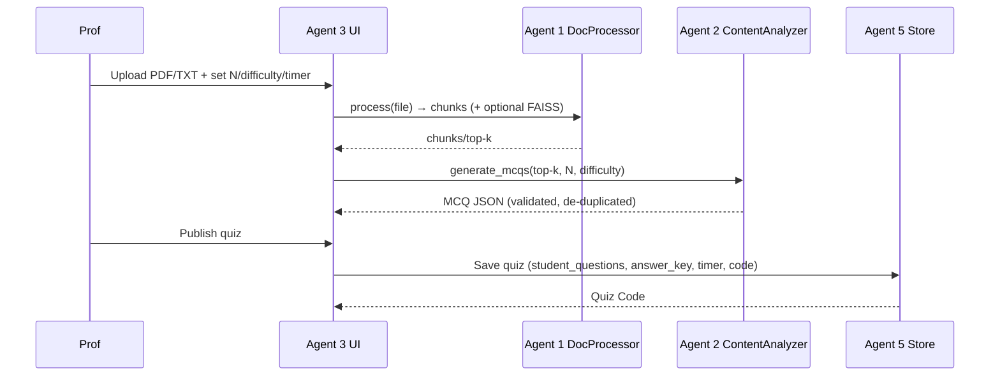
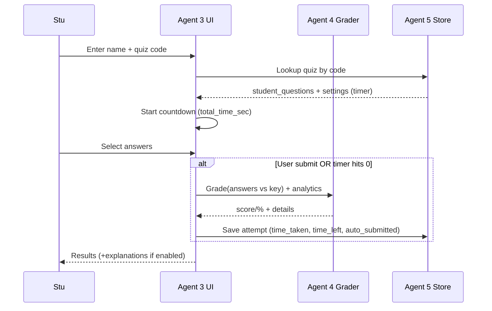

# Brain Brew — Professor/Student Quiz System

A sleek Streamlit app for building auto-graded quizzes with optional RAG context, LLM-generated MCQs, a professor-configurable **total exam timer**, **student countdown with auto-submit**, and attempt analytics. Landing page includes lightweight SVG art + floating title animation.

---

## Features
- **Professor / Student roles**
- **LLM MCQ generation** (default model: `gpt-4o-mini`; demo mode if no key)
- **Optional RAG authoring**: ingest PDF/TXT, chunk & embed (FAISS + SentenceTransformers)
- **Timer**: set total exam minutes (min 2); live countdown; auto-submit on expiry
- **Grading & analytics**: score, %, time taken, time left, auto-submitted flag
- **Publish & share**: one-click quiz code for students
- **No secrets leakage**: answer key never sent to the client

---

## Quickstart

### 1) Prerequisites
- Python **3.10+**
- pip

### 2) Install
```bash
python -m venv .venv
# Windows: .venv\Scripts\activate
# macOS/Linux:
source .venv/bin/activate

pip install -r requirements.txt
```

> **RAG extras** (optional PDF/RAG features):
```bash
pip install pypdf sentence-transformers faiss-cpu
```

### 3) Configure
Create `.env` in the project root:

```env
# LLM
OPENAI_API_KEY=sk-...         # omit to run in demo mode
OPENAI_MODEL=gpt-4o-mini
# OPENAI_BASE_URL=https://api.openai.com   # optional override

# App
PROFESSOR_PASSCODE=prof123
QUIZ_STORE_PATH=quiz_store.json

# LLM tuning (optional)
MAX_TOKENS=1500
COST_PER_CALL=0.002

# RAG
RAG_EMBED_MODEL=all-MiniLM-L6-v2
```

### 4) Run

```bash
export OPEN_API_KEY="Your OpenApi Key"
```

```bash
pip install -r requirements.txt
```

```bash
streamlit run main.py
```

Open the URL printed in your terminal (usually `http://localhost:8501`).

---

## Architecture: Agents

The app is organized into small “agents” with single-responsibility roles.

| Agent | Name | Responsibilities | Inputs | Outputs |
|---|---|---|---|---|
| **0** | **LLM Client** | Wraps OpenAI Chat Completions; JSON responses; demo stub if no key | system/user prompts, model, temp | parsed JSON (MCQs) |
| **1** | **DocumentProcessor (RAG)** | Ingest PDF/TXT → text → chunks → (optional) embeddings & FAISS index | uploaded file | `{chunks, text}`, optional vector store |
| **2** | **ContentAnalyzer** | Prompt engineering and MCQ generation + validation & de-dup | top-k chunks, settings (N, difficulty) | validated MCQs (question, 4 options, answer, explanation) |
| **3** | **Quiz UI** | Render questions; collect selections; progress UI | question list | UI state (`q_mcq_*`) |
| **4** | **Grader & Analytics** | Server-side scoring; study hints; timing stats | questions + selections | `{score, total, details}`, `{percentage, plan}` |
| **5** | **Store** | Persist to JSON; publish codes; list attempts; toggle settings | quiz/attempt payloads | JSON store updates |

### Cross-cutting
- **Role & Auth Gate**: forces professor passcode on every switch to "Professor".
- **Timer Engine**: professor sets **total minutes**; student sees mm:ss countdown; auto-submit once at 0; attempts save `time_taken_sec`, `time_left_sec`, `auto_submitted`.

---

## End-to-End Flow

### High-level flow


### Detailed professor sequence


### Detailed student sequence


---

## Data Model (JSON store)

**Quiz record**
```json
{
  "quiz_id": "uuid",
  "title": "Strings & Stacks",
  "code": "ABC123",
  "settings": {
    "difficulty": "medium",
    "num_questions": 10,
    "show_explanations": true,
    "shuffle_choices": true,
    "total_time_sec": 1200,
    "time_per_question_min": 1.2
  },
  "student_questions": [{"id": "...", "question": "...", "options": ["A","B","C","D"]}],
  "answer_key": {"qid": 1},
  "explanations": {"qid": "why"},
  "status": "published",
  "created_at": 1700000000
}
```

**Attempt record**
```json
{
  "attempt_id": "uuid",
  "quiz_id": "uuid",
  "student_name": "Ada",
  "student_email": "ada@uni.edu",
  "answers": [{"qid": 1, "selected": 2}],
  "score": 8,
  "total": 10,
  "started_at": 1700000000,
  "submitted_at": 1700000710,
  "time_taken_sec": 710,
  "time_left_sec": 490,
  "auto_submitted": false
}
```

---

## Usage

### Landing
Pick **Professor** or **Student** (animated SVGs + floating title).

### Professor
1. **Login** with passcode.  
2. **Authoring**: upload **PDF/TXT**, pick **#Questions**, **Difficulty**, **Top‑k**. (Sample PDFs are provided in the sample folder).  
3. **Build Quiz**: MCQs appear; answers only in professor preview.  
4. **Timer**: set **Total time (minutes)** (default `2 × N`, min 2).  
5. **Publish**: get a **Quiz Code**.  
6. **Dashboard**: see attempts (score, %, time taken/left, auto-submit), toggle student explanations.

### Student
1. **Join** with **Name** + **Quiz Code**.  
2. Take quiz with **live countdown**.  
3. Submit or **auto-submit** at zero.  
4. View **results** (+ explanations if enabled).

---

## Timer Details
- Professor sets **total exam duration** (min 2). Default: **`2 × (# of questions)`**.
- Student sees **mm:ss** countdown and progress bar.
- **Auto-submit** fires once at zero; inputs lock.
- Attempts store **time_taken**, **time_left**, and **auto_submitted**.

---

## RAG (Optional)
- PDF/TXT → **chunks → (optional) embeddings (SentenceTransformers) → FAISS**.
- Top-k chunks feed the LLM for **context-grounded MCQs**.
- If RAG deps are missing, app falls back to a small sample.

---

## Configuration (config.py)
- API key lookup: hardcoded `API_KEY` → `.env OPENAI_API_KEY` → `st.secrets`.
- Default model: **`gpt-4o-mini`** (`OPENAI_MODEL`).
- Passcode: `PROFESSOR_PASSCODE`.
- Storage: `QUIZ_STORE_PATH` JSON.

---

## Project Structure
```
.
├─ main.py          # Streamlit app + agents
├─ config.py        # configuration
├─ requirements.txt # dependencies
├─ quiz_store.json  # runtime data (created)
└─ README.md
```

---

## Troubleshooting
- **Second-by-second timer** → `pip install streamlit-autorefresh` (JS fallback also included).
- **No API key** → app uses demo MCQs.
- **Embeddings fail** → ensure `faiss-cpu` + `sentence-transformers` are installed correctly.

---

## Security
- Simple passcode gate for instructor; use a real auth provider for production.
- Answer keys never go to the client.

---

## License
MIT

This project is licensed under the MIT License — see the LICENSE file for details.
